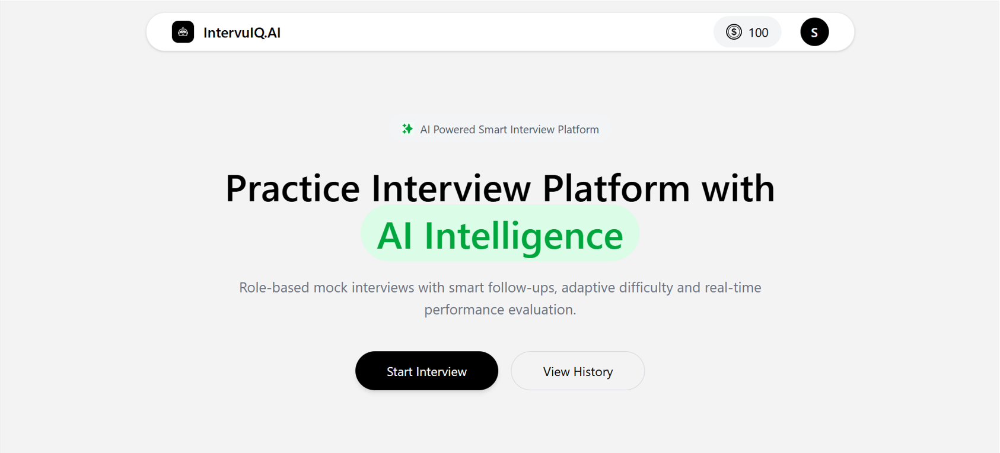
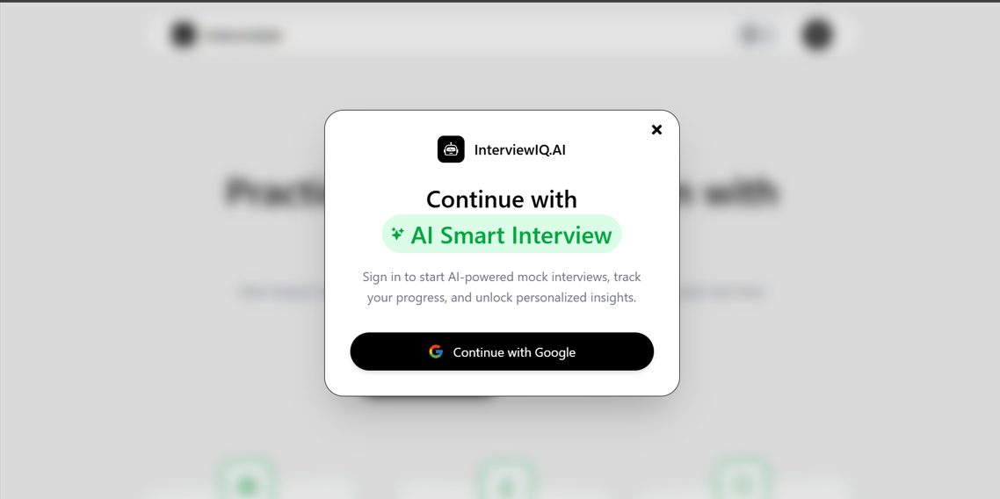
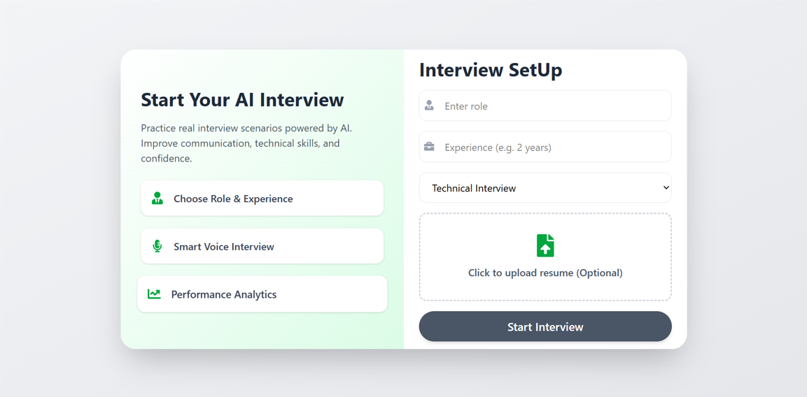
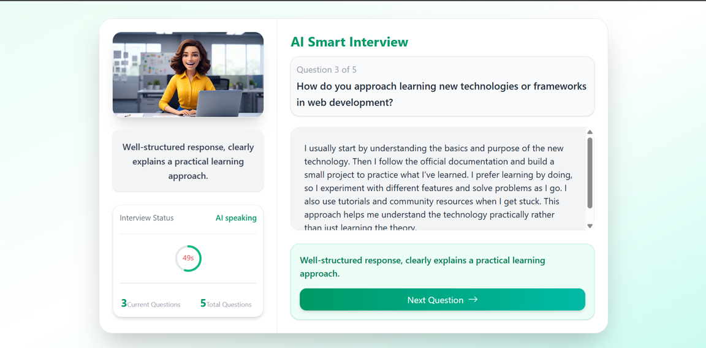
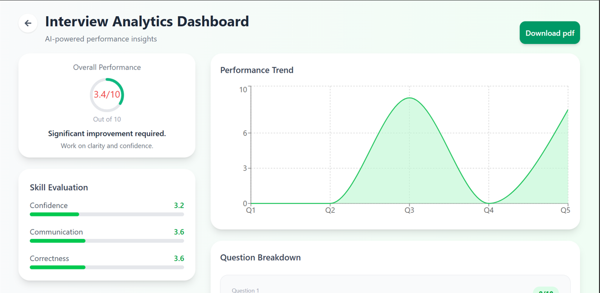
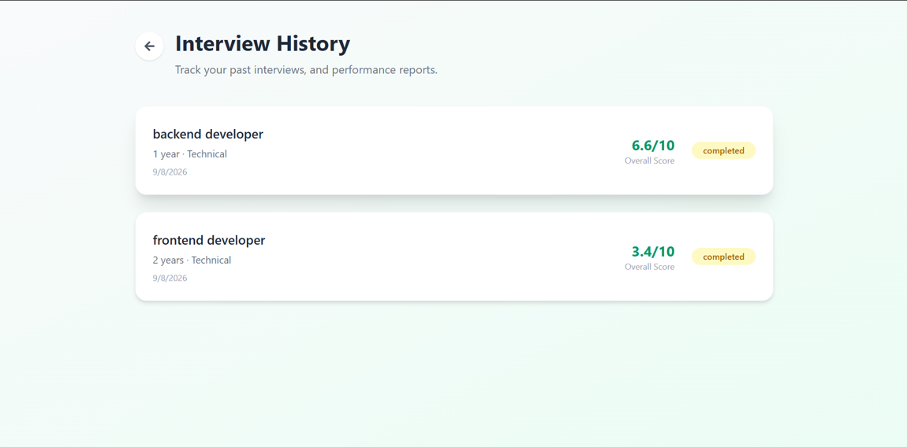

# ✨ IntervuIQ.AI — AI-Powered Mock Interview Platform

<p align="center">
  
</p>


**Live demo:** [https://intervu-iq-ai.vercel.app/](https://intervu-iq-ai.vercel.app/)


---

## 📌 About the Project

**IntervuIQ.AI** is an AI-powered mock interview platform designed to help users practice job interviews in a realistic environment.

Users can select a job role and experience level, start an AI-driven technical interview, answer questions, and receive performance feedback. The platform also keeps interview history so users can review their previous performance and track improvement over time.

## 🚀 Features

- 🤖 **AI-Powered Mock Interviews** — Conduct interactive interviews with AI.
- 👨‍💻 **Role-Based Interviews** — Practice according to a selected job role.
- 📊 **Performance Analytics** — Get scores and insights on interview performance.
- 📈 **Performance Trends** — Visualize performance across interview questions.
- 📝 **Question-by-Question Feedback** — Receive feedback after answering questions.
- 📚 **Interview History** — Review previous interviews and their scores.
- 📄 **Resume Upload** — Upload a resume to support personalized interviews.
- 🎙️ **Smart Voice Interview** — Uses browser speech synthesis and speech recognition where supported.
- 🔐 **Google Authentication** — Sign in securely using Google.
- 📱 **Responsive UI** — Designed for a smooth experience across screen sizes.


## 🔄 How It Works

1. **Sign in** using Google.
2. **Choose a role and experience level**.
3. **Optionally upload your resume**.
4. **Start the AI interview**.
5. **Answer the generated interview questions**.
6. **Receive AI-generated feedback and scores**.
7. **Review analytics and previous interviews** from the history section.

## 📸 Screenshots

Google Sign-In:



Home Page:


Interview Setup:



AI Smart Interview:



Interview Analytics Dashboard:



Interview History:



## ⚙️ Local Development

### 1. Clone the repository

```bash
git clone https://github.com/Shishirbudhathoki/IntervuIQ.AI
cd IntervuIQ.AI
```

### 2. Install dependencies

Install dependencies for both applications:

```bash
cd client
npm install
cd ../server
npm install
```

### 3. Configure environment variables

Create `server/.env`:

```env
PORT=8000
CLIENT_URL=http://localhost:5173
MONGODB_URL=your_mongodb_connection_string
JWT_SECRET_KEY=your_jwt_secret
OPENROUTER_API_KEY=your_openrouter_api_key
NODE_ENV=development
```

Create `client/.env`:

```env
VITE_API_URL=http://localhost:8000
VITE_FIREBASE_API_KEY=your_firebase_web_api_key
```

The remaining Firebase web configuration is defined in `client/src/utils/firebase.js`. Configure Google sign-in in the Firebase console and add your local and production domains to the authorized domains list.

> **Important:** Never commit `.env` files, API keys, passwords, or other secrets to GitHub.

### 4. Run the application

Start the backend in one terminal:

```bash
cd server
npm run dev
```

Start the frontend in another terminal:

```bash
cd client
npm run dev
```

Open the local URL shown by Vite, usually `http://localhost:5173`.

## 📁 Project Structure

```text
IntervuIQ.AI/
├── client/
│   ├── src/
│   ├── public/
│   └── package.json
├── server/
│   ├── config/
│   ├── controllers/
│   ├── models/
│   ├── routes/
│   ├── services/
│   └── package.json
├── docs/
│   └── screenshots/
│       ├── home.png
│       ├── interview-setup.png
│       ├── ai-interview.png
│       ├── analytics.png
│       ├── history.png
│       └── login.png
├── README.md
└── .gitignore
```

The payment routes and Khalti integration are present in the server code but are currently disabled in `server/index.js`.

---

<p align="center">
  ⭐ If you find this project useful, consider giving it a star!
</p>
